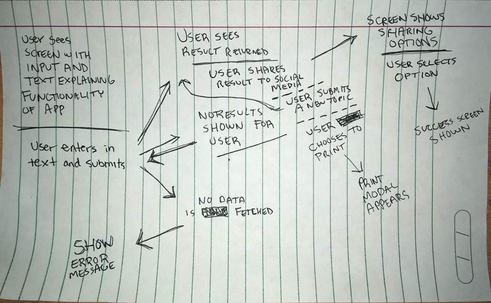
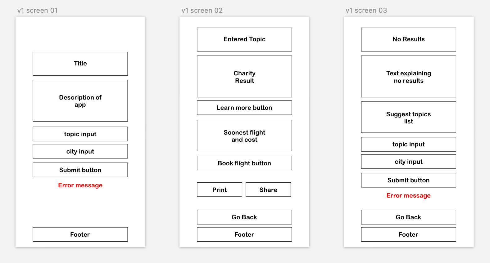
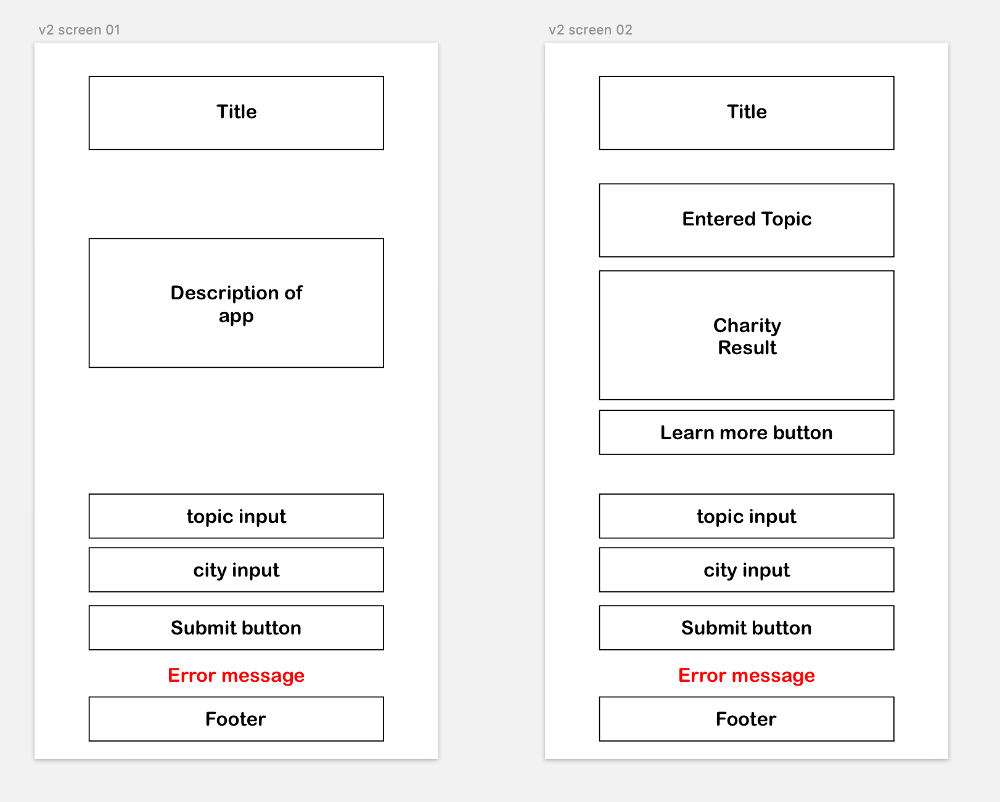
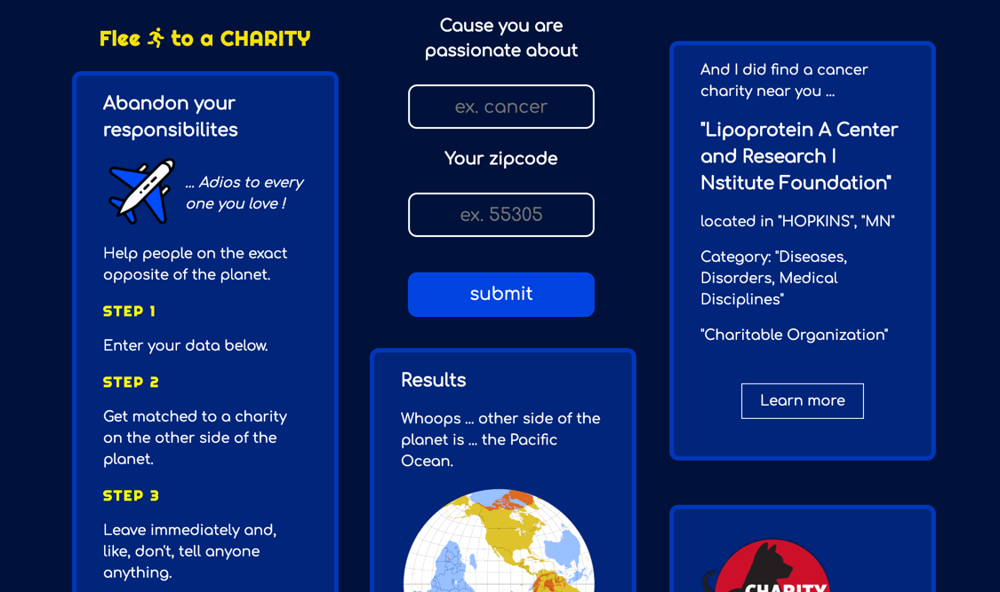

# Flee to a Charity

Find a charity on the opposite side of the planet. Why? To abandon all your responsibilities and loved ones to help people you've never seen before in a place you've never been to, that's why!

## Motivation

I thought about doing an app to find a charity near the user. But I'm sure that's been done plenty of times. So the idea of finding the inverse solution became appealing as it seemed novel and stupid but charming. Sums me up quite nicely, I think.

## Build Status

## Pre-Production

User Flow:

The idea was to match a user with a charity on the other side of the world. There were plans to use a travel API to get the soonest flight to that location.

Wireframes:

I was planning on adding a share button along with functionality to print results. 

I decided to scale back MVP functionality to only return a charity.

Final design:

It became clear in research that there are no charities on the direct opposite side of the planet. Because for everyone in the United States, that's the pacific ocean. So finding the nearest philinthropic endeavor in the vast stretches of floating plastic seemed futile. Thus I pivoted to explaining antipodes and informing the user that China isn't under our feet in reality.

I also included a link to the top-rated charities. I decided to move on to the next project instead of sinking more time into this little eye-candy. I hope it leaves users wanting more. Or infuriated. Either one is fine. 

## Built With

* HTML
* CSS
* Javascript
* jQuery
* Love <3

## Features

* Search for a charity based on interest and location
* Learn about antipodes
* Redirect to Top-rated charaties

## Demo

- [Live Demo](https://nick-nack-attack.github.io/flee-to-a-charity/)

## Authors

* **Nick** - ** - Literally everything

## Acknowledgments

**Info** https://www.antipodesmap.com/
**API** https://www.charitynavigator.org/
**Graphics** http://flaticon.com

