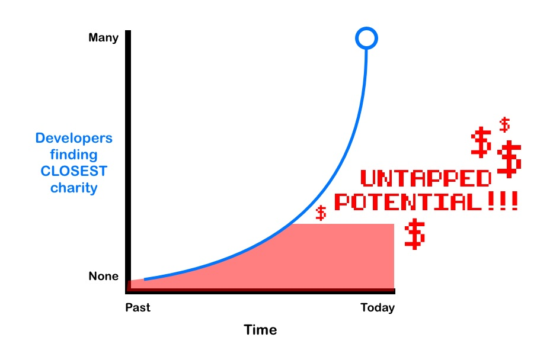

# Flee to a Charity

Find a charity on the opposite side of the planet. Why? To abandon all your responsibilities and loved ones to help people you've never seen in a place you've never been to before, that's why!

## Motivation

I wanted to help users find a local charity they'd be interested in. But I'm sure that idea has been executed oodles of times. So the idea of finding the inverse solution became appealing as it seemed novel, stupid, but charming.

## Build Status

## Pre-Production

User Flow:

I started the project with the the idea to match a user with a charity on the other side of the world. Originally there were plans to use a travel API to get the soonest flight to that location as well.

I was going to add a share button along with exporting the end-user's results to PDF (to print).

I decided to scale back MVP functionality to only return a charity based on subject and location.

It became clear with research that there are no charities on the direct opposite side of the planet because, for everyone in mainland United States, that's the middle of an ocean. So finding the nearest philinthropic endeavor in the vast stretches of floating plastic seemed unworthy of a solution. Thus I pivoted to informing the end-user that China isn't actually under our feet and explaining antipodes.

Final design:

I also included a link to the top-rated charities. I decided to move on to the next project instead of sinking more time into this little piece-of-work. I hope it leaves users wanting more. Or infuriated. Either one is fine. 

## Design

I used Adobe to find a royal blue color palette.

## Built With

* HTML
* CSS
* Javascript
* jQuery
* Love <3

## Features

* Search for a charity based on interest and location
* Learn about antipodes
* Redirect to Top-rated charaties

## Demo

- [Live Demo](https://nick-nack-attack.github.io/flee-to-a-charity/)

## Authors

* **Nick** - Literally everything

## Acknowledgments

* **Research** https://www.antipodesmap.com/
* **API** https://www.charitynavigator.org/
* **Graphics** http://flaticon.com
* **Color** https://color.adobe.com/create

